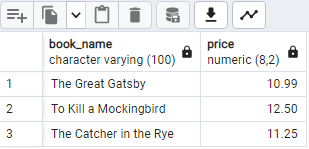
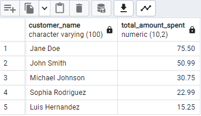
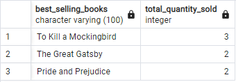
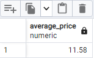
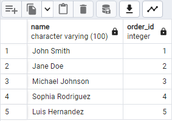
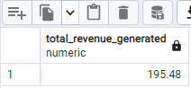
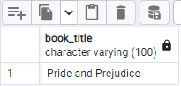
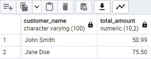
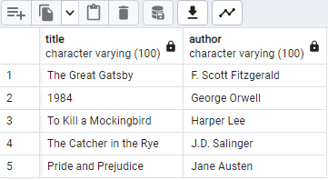
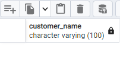

# SQL_Bookstore_Analysis

## ABOUT THE CASE STUDY

This is one of the SQL case study provided by Data in Motion. More details about this case study can be found below.

An online bookstore that wants to maximize sales and customer pleasure is the subject of the case study. My job as a data analyst is to examine sales data and provide conclusions to enhance company performance. You can find patterns, client preferences, and growth prospects by examining data from your books, customers, orders, and sales. In order to increase sales and strengthen the position of the online bookshop in the marketplace, your analysis will help guide decisions about inventory management, marketing initiatives, and customer engagement.

## DATASETS

The Bookstore dataset contains four tables. The table and their columns are below:
- Books: book_id, title, author, genre, price.
- Customers: customer_id, name, email, city, country.
- Orders: order_id, customer_id, order_date, total_amount.
- Order_Items: order_item_id, order_id, book_id, quantity.

## QUESTIONS
1. Retrieve all books with a price greater than $10. 
2. Find the total amount spent by each customer in descending order.
3. Retrieve the top 3 best-selling books based on the total quantity sold.
4. Find the average price of books in the Fiction genre.
5. Retrieve the names of customers who have placed orders.
6. Find the total revenue generated from book sales.
7. Retrieve the books with titles containing the word “and” (case-insensitive).
8. Find the customers who have placed orders worth more than $50.
9. Retrieve the book titles and their corresponding authors sorted in alphabetical order by author.
10. Find the customers who have not placed any orders.

  
## OUTPUT/ANSWER TO EACH QUESTION

1. 

2. 

3. 

4. 

5. 

1. 

2. 

3. 

4. 

5. 

NOTE: Queries can be found in the file named Book_Store_Sales.sql or in the view code option above.
